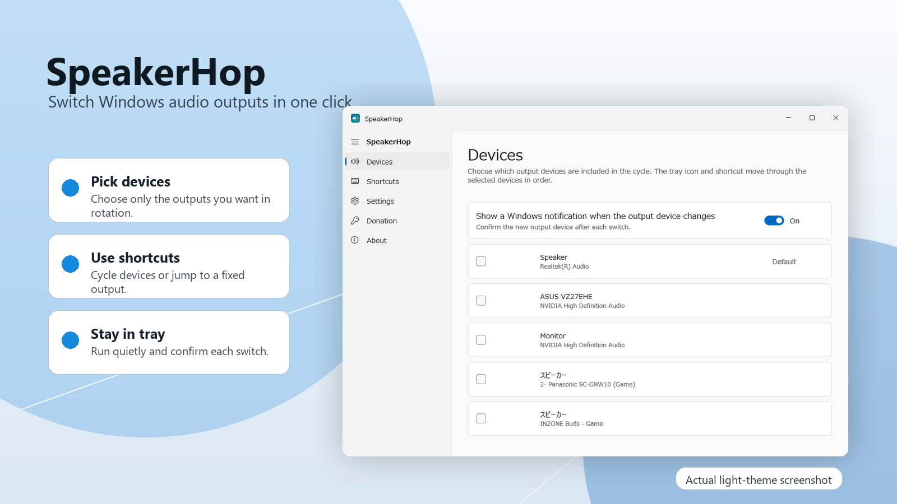

# SpeakerHop

WinUI 3 desktop app for switching the Windows default audio output device from the tray icon or global shortcuts.



SpeakerHop is a small Windows tray utility for people who frequently move audio between speakers, headphones, monitors, TVs, and virtual devices. Choose the output devices that should be part of the cycle, then switch between them from the tray icon or a global shortcut without opening Windows settings.

The README image uses an actual light-theme English SpeakerHop screenshot embedded in a generated presentation background. The Devices page lets you select which active render endpoints are included in the switching cycle. Disconnected or unused outputs can stay out of the rotation, while notifications confirm each successful switch.

## Features

- Left-navigation WinUI 3 settings window.
- Tray icon left-click cycles through selected output devices.
- Device settings page controls which render endpoints are included in the cycle.
- Global shortcuts can cycle, switch to a fixed device, change volume, or toggle mute.
- MSIX manifest and packaging script are included for Microsoft Store preparation.

## Build

Use Visual Studio Build Tools MSBuild. `dotnet build` may fail on machines where the .NET SDK cannot find Appx/Pri packaging tasks.

```powershell
& 'C:\Program Files (x86)\Microsoft Visual Studio\2022\BuildTools\MSBuild\Current\Bin\MSBuild.exe' src\SpeakerHop\SpeakerHop.csproj /restore /p:Configuration=Release /p:Platform=x64 /m
```

## Create unsigned MSIX

```powershell
.\build-package.ps1 -Version 1.0.0.0 -Publisher 'CN=Your Partner Center Publisher'
```

The unsigned package is written to `artifacts\SpeakerHop_<version>_x64.msix`. For Store submission, replace the package identity and publisher with the Partner Center reserved values, add final brand assets/screenshots, sign or let Partner Center sign as appropriate, and run Windows App Certification Kit.

## Store review note

Windows does not expose a public WinRT API for setting the default render endpoint. This app uses the desktop CoreAudio endpoint APIs plus the commonly used PolicyConfig COM interface, and therefore ships as a full-trust packaged desktop app with `runFullTrust`. Keep this explicit in the Store submission notes.
